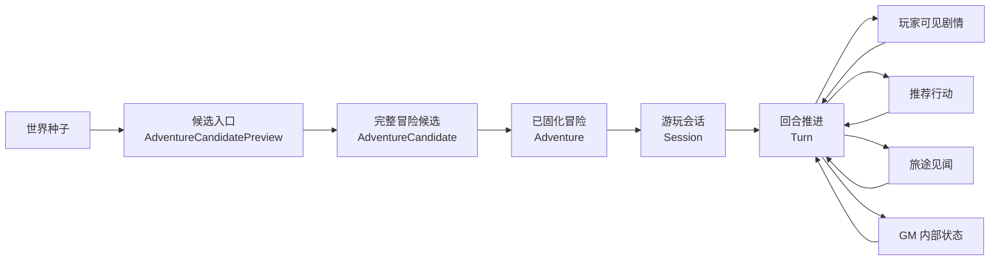
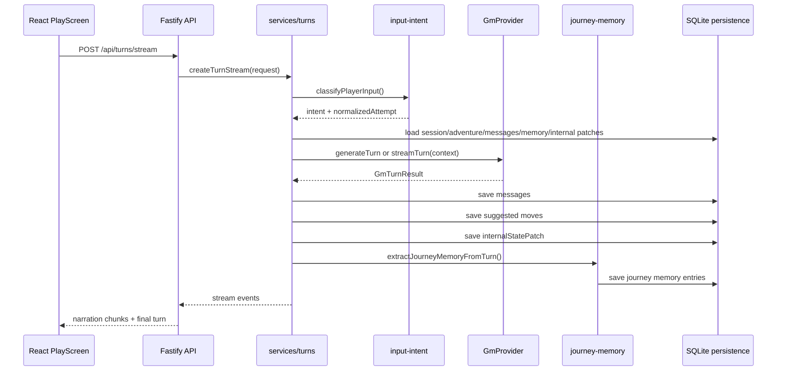
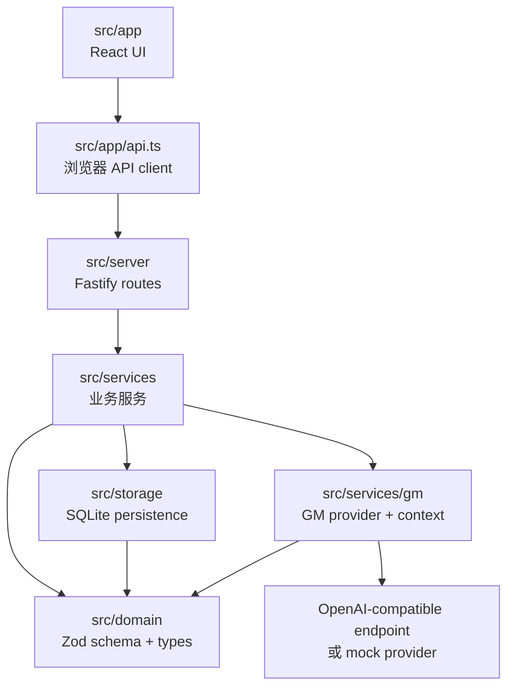
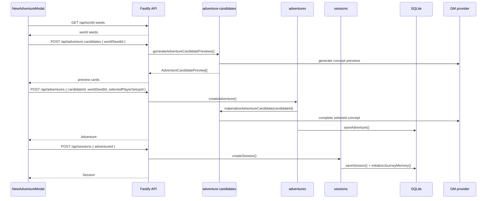
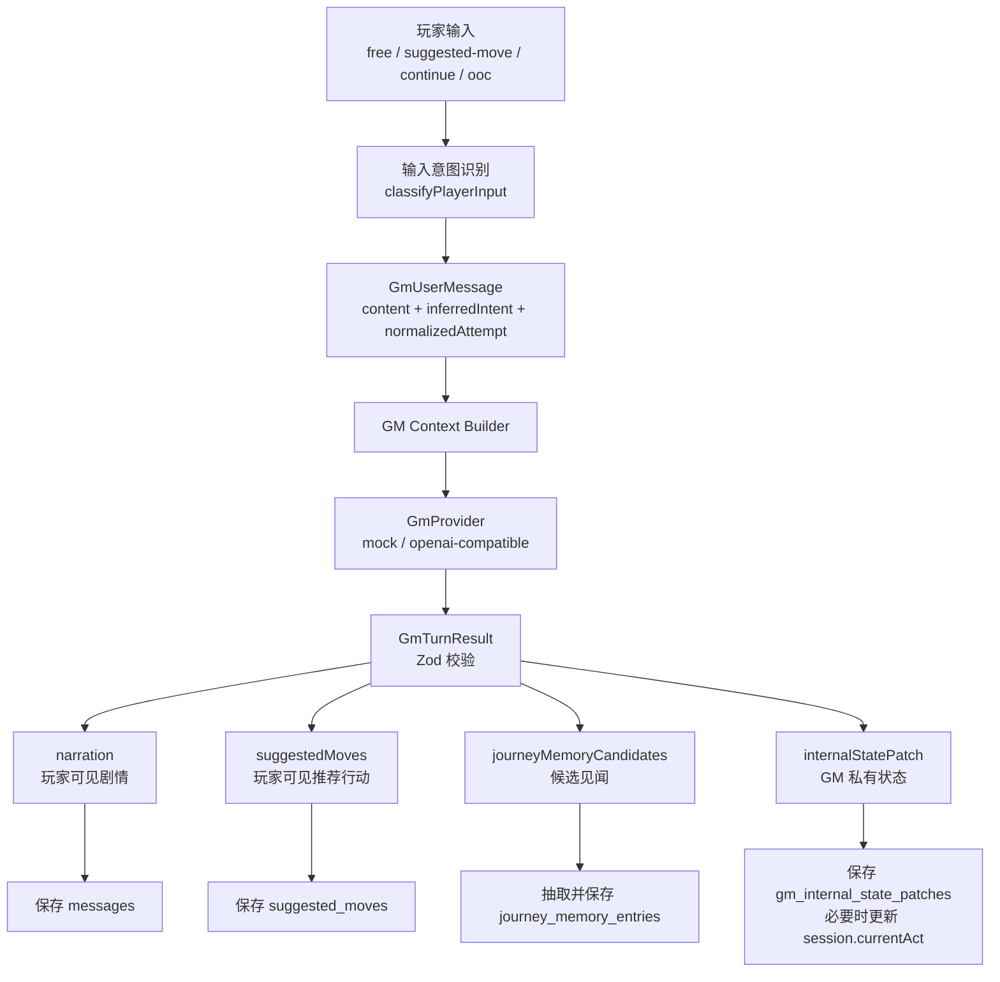
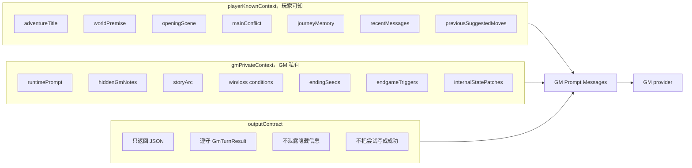
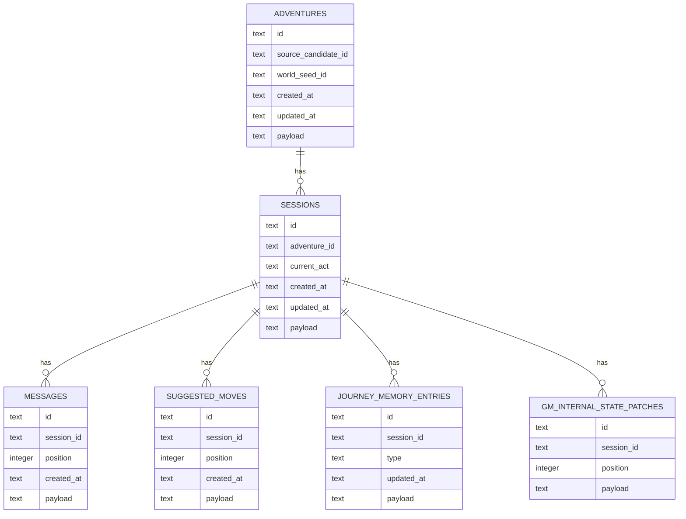
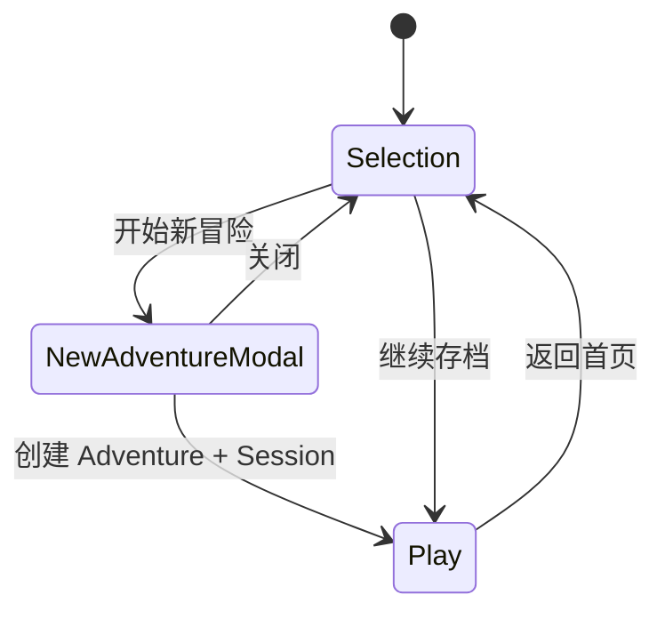

# 当前系统核心架构说明

阅读对象：个人阅读  
当前核对日期：2026-04-28  
文档性质：个人理解稿，不是项目需求源头，也不是 agent 执行依据。后续开发、审查和实现判断，仍以当前代码、`README.md`、`docs/local-web-version-plan.md`、`docs/technical-plan.md`、`docs/testing.md` 和 `docs/engineering-agreement.md` 为准。

## 这套系统到底是什么

Isekai 当前是一个本地自玩的 AI 互动故事 Web 应用。它的核心不是普通聊天框，也不是单纯调用模型生成一段文本，而是把玩家自由输入约束进一条可持续、可存档、有结局的冒险闭环里。

可以把它理解成一个本地 GM runtime：

- 玩家选择世界种子，系统生成无剧透冒险入口。
- 玩家选中入口后，服务端补全并固化完整冒险包。
- 游玩时，玩家输入只代表意图和尝试，不能直接改写故事事实。
- GM provider 根据稳定上下文推进剧情，返回结构化结果。
- 系统把玩家可见内容、推荐行动、旅途见闻和 GM 内部状态分别落库。
- 下一回合继续从这些事实和状态出发，而不是让模型每次重新发明世界。

一局游戏的主链路可以简化成这样：

## 核心闭环

如果只抓一个核心，应该抓 `Adventure -> Session -> Turn -> State -> Next Turn` 这条闭环。

`Adventure` 是故事世界的锚点，里面有世界公开前提、开局、主线矛盾、阶段结构、胜败条件、结局种子、隐藏 GM 笔记和 runtime prompt。它决定这段冒险是什么，不让后续回合随意漂移。

`Session` 是一次实际游玩的存档入口，记录当前 act、会话消息、推荐行动、旅途见闻和 GM 内部状态 patch。

`Turn` 是系统真正运转的地方。玩家提交输入后，系统先识别输入意图，再组装 GM 上下文，调用 provider，校验 `GmTurnResult`，最后把不同类型的数据写回对应层。

## 代码分层

当前项目是 React + TypeScript + Vite + Fastify + Zod + SQLite。代码分层比较直接，核心业务不应该塞进 React 组件。

| 层 | 目录 | 当前职责 |
| --- | --- | --- |
| UI | `src/app` | 首页、开始新冒险、存档列表、游玩页、旅途见闻展示，只消费玩家可见数据。 |
| Domain | `src/domain` | Zod schema、类型、业务实体和输出契约，比如 Adventure、Session、GM result、Journey Memory。 |
| Services | `src/services` | 冒险生成、会话管理、回合推进、输入意图识别、旅途见闻抽取。 |
| GM Services | `src/services/gm` | GM provider 接口、mock provider、OpenAI-compatible provider、GM context builder。 |
| Storage | `src/storage` | SQLite 初始化和 persistence，负责把已开始的冒险、会话、消息、推荐行动、见闻、内部 patch 写入本地数据库。 |
| Server | `src/server` | Fastify routes，做 HTTP 入口、请求校验、错误映射、SSE 转发。 |
| Shared | `src/shared` | 前后端共享的健康检查、日志工具等。 |

整体依赖方向大致是：

## 新冒险生成链路

新冒险不是一次性把完整故事包扔给前端。当前设计分两段，避免候选卡片泄露主线、结局、隐藏 GM 笔记，也避免前端回传完整候选污染服务端事实。

当前关键点：

- `POST /api/adventure-candidates` 返回 `AdventureCandidatePreview[]`，只给标题、无剧透简介、玩家身份预览和标签。
- preview concept 临时保存在 `src/services/adventure-candidates.ts` 的内存 Map 里，未选中的候选不会落库。
- `POST /api/adventures` 只接收 `candidateId`、`worldSeedId` 和可选的 `selectedPlayerSetupId`。
- 选中候选后，服务端才 materialize 完整 `AdventureCandidate`，再创建并保存 `Adventure`。
- `createSession()` 会初始化玩家可见的旅途见闻，比如身份、已知 NPC、已知地点。

## 回合推进链路

回合推进是系统最重要的运行时链路。它的价值不只是生成下一段剧情，而是把一次玩家输入拆成不同层的数据，并把它们写回系统状态。

这里有几条边界很关键：

- 玩家输入不是 canon。玩家可以说想做什么，不能直接声明已经成功。
- `input-intent` 会把越权结果声明识别为 `world_override_attempt`，并给出 `normalizedAttempt`。
- GM provider 必须返回 `GmTurnResult` JSON，不能直接把模型文本传给玩家。
- `suggestedMoves` 只能表达可以尝试的行动，不能表达已经成功的结果。
- `journeyMemoryCandidates` 只保存高置信、玩家已经知道的信息。
- `internalStatePatch` 可以记录隐藏判断，但不能进入玩家可见 API 响应。

## GM 上下文的两层边界

GM context builder 当前把上下文分成三块：玩家可知、GM 私有、当前输入，外加输出契约。

这层设计决定了后续大部分功能怎么加：

- 玩家界面只显示 `narration`、`suggestedMoves`、`journeyMemory` 这种玩家可见内容。
- `hiddenGmNotes`、胜败条件、章节目标和私有备注只进入 GM 私有上下文。
- 如果未来要加日志、任务、百科、Dungeon Mind，也应该继续维持玩家可见层和 GM 私有层的边界。

## 数据模型和持久化

当前 SQLite 表比较少，每张表都保留必要索引字段，同时把完整对象作为 JSON payload 保存，并在读写时走 Zod schema。

几个实现细节需要记住：

- 默认数据库路径是 `data/isekai.sqlite`，可以用 `ISEKAI_DB_PATH` 覆盖。
- 测试环境默认走内存数据库。
- persistence 层保存和读取时都 parse schema，裸 JSON 不直接成为业务对象。
- 服务层还有内存缓存，比如 sessions、adventures、messages、suggested moves、journey memory、internal patches。
- 删除 session 时，会删除该 session 的消息、推荐行动、旅途见闻和内部 patch。如果对应 adventure 没有剩余 session，也会删除 adventure。

## API 表面

当前已实现的玩家主路径 API：

| API | 用途 |
| --- | --- |
| `GET /api/health` | 健康检查。 |
| `GET /api/world-seeds` | 读取内置世界种子。 |
| `POST /api/adventure-candidates` | 根据世界种子生成候选入口 preview。 |
| `POST /api/adventures` | 把选中的 preview materialize 成完整 Adventure。 |
| `GET /api/adventures/:id` | 读取单个 Adventure。 |
| `POST /api/sessions` | 为 Adventure 创建游玩会话。 |
| `GET /api/sessions` | 读取所有存档快照。 |
| `GET /api/sessions/latest` | 读取最近存档。 |
| `GET /api/sessions/:id` | 读取指定存档快照。 |
| `DELETE /api/sessions/:id` | 删除存档。 |
| `GET /api/sessions/:id/journey-memory` | 读取旅途见闻。 |
| `POST /api/sessions/:id/journey-memory/extract` | 从历史消息重新抽取旅途见闻。 |
| `POST /api/turns` | 非 streaming 回合生成。 |
| `POST /api/turns/stream` | SSE 回合生成，当前前端游玩页使用这条。 |

当前文档里出现但还没作为正式能力实现的内容，需要单独看待：

- regenerate、rewind、branch、save message。
- provider 设置页面和设置 API。
- logs、quests、codex 这类玩家不可见或半内部数据接口。
- 导入导出 JSON。
- Dungeon Mind 和 Visual Novel。

## 前端如何消费系统

前端的定位是玩家可见体验，不负责维护故事事实。

`App.tsx` 管两种状态：选择页和游玩页。选择页展示首页、存档列表、新冒险弹窗。开始或继续后进入 `PlayScreen`。

`useNewAdventureFlow` 管新冒险流程：

- 打开弹窗。
- 选择世界种子。
- 调 `generateAdventureCandidates()`。
- 选择候选和玩家身份。
- 调 `createAdventure()`。
- 调 `createSession()`。
- 把 adventure 和 session 交给 `App` 进入游玩页。

`PlayScreen` 管游玩体验：

- 故事区只展示 opening scene 和 assistant messages。
- 下一步区域展示推荐行动、自由输入、继续、局外提醒。
- 提交回合时走 `submitTurnStream()`。
- SSE 事件到达后，前端增量更新剧情、推荐行动和最终消息。
- 回合结束后刷新旅途见闻。
- 右侧和弹层只展示旅途见闻，不展示 GM 私有状态。

## AI provider 边界

当前有两个 provider 路径：

- `mock`：开发、测试、无 key 演示。
- `openai-compatible`：真实游玩路径，走 OpenAI-compatible `/chat/completions`。

provider 只负责生成结构化结果，不直接决定存档怎么写。真正能进入系统状态的数据必须先过 schema：

- 冒险候选 concept 和完整候选过 adventure candidate 相关 schema。
- 输入意图过 `InputIntentClassificationSchema`。
- GM 回合结果过 `GmTurnResultSchema`。
- 推荐行动还会额外检查不能是结果声明。

真实模型失败时不静默降级到 mock。这个原则很重要，因为静默降级会让玩家以为当前故事仍由真实模型推进，实际却换成了测试 provider。

## 当前测试护栏

测试体系已经按系统风险分层：

- domain 测 schema 和基础业务规则。
- services 测世界种子、候选生成、冒险创建、session、turn、journey memory。
- `services/gm` 测 context builder、mock provider、OpenAI-compatible provider。
- server API 用 Fastify `server.inject()`，不启动真实端口。
- UI 用 React Testing Library + jsdom。
- E2E smoke 用 Playwright + mock provider 和临时测试数据库。

后续改核心链路时，优先补这些风险点的测试：

- preview 不泄露完整冒险包。
- create adventure 只能根据服务端保存的 candidate id 补全。
- 玩家越权输入被降级成尝试。
- `GmTurnResult` 的私有内容不进入玩家响应。
- 旅途见闻只保存玩家已知事实。
- SSE 回合事件能让前端稳定恢复最终状态。

## 维护这份文档时怎么更新

这份文档只服务理解，不服务执行。更新时建议按这个顺序：

1. 先看当前代码，尤其是 `src/domain`、`src/services`、`src/services/gm`、`src/storage`、`src/server`、`src/app`。
2. 再看 `docs/local-web-version-plan.md` 和 `docs/technical-plan.md`，确认哪些是当前实现，哪些只是计划项。
3. 如果产品边界、架构、API、AI 输出契约或存档结构真的变了，先更新正式文档，再更新这份个人说明。
4. 不要反过来用这份文档要求 agent 改代码。它可以帮助快速理解系统，但不能替代代码和正式文档。

一个简单判断标准：如果某句话会影响后续实现怎么做，它应该进入正式文档；如果只是帮助理解当前系统，可以留在这里。
